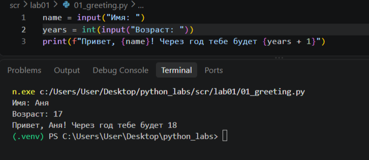
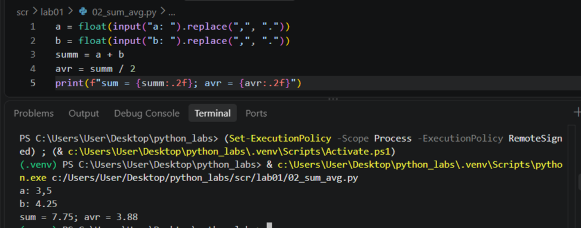
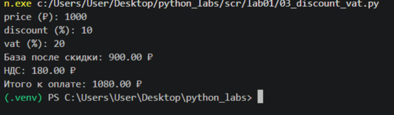
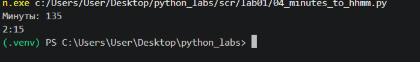
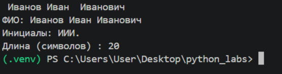
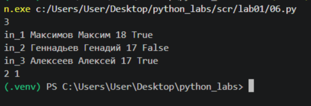
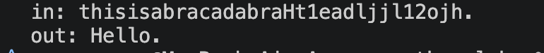

# python_labs
# Лабораторная работа 1 
##  Задание 1 
программа принимает значения имени и возраста, выводит приветствие, учитывая вводные данные

##  Задание 2
программа берет входные значения, при необзодимости (если введено так) меняет "," на ".", произовдит операции и выводит значения, сформатированные так, чтобы после запятой было 2 значения

##  Задание 3
принимание входные значения, приводит к floaty, производит над нами операции, вывоит полученные значения, чтобы у них еще было 2 зна после запятой

##  Задание 4
ввела минуты, нашла целое колво часов, поделив на 60, колво минут, вывела значения

##  Задание 5
ввела значение, разделила по пробелу на отдельные списки, назначила каждому жлементу переменную, (name, sernsme...), забрала из каждого элемент первое значение, сделала чтобы буквы были заглавные. пересобрала ФИО без лишних пробелов, посчитала в отдельной переменной длину, вывела значния

##  Задание 6
завела переменную n, сделала счетчик для подсчета формата обучение, создала цикл, в котором будут проходиться по каждой введенной информации и проверять последнее значение.Если оно == True, то прибавляю 1 к очному формату, иначе - к заочному. Вывожу значения

## Задание 7*
нашла две первые буквы используя цикл, записала индексы этиъ символов, чтобы найти расстояние на котором расположены дальнейшие символы слова. Прошлась по срезу строки и собрала слово, учитывая интервал.

