# python_labs

# Лабораторная работа 3
##  Задание 1 

1. в зависимости от данных, переданных функцию проделываю разные операции. все буквы слов делаю нижнего регистра, убираю пробелы, меняю е на ё, пересобираю слово, без лишних пробелов.
2. разделаю предложения на отдельные слова используя регуярные выражения по примеру с презентации
3. создаю словарь - счетчик значений по примеру из презентации. Присваивая каждому ключу свое количественное значение 
4. по примеру-шаблону из презентации создаю сортирую значения по второму значению словаря, если значения одинаковые, то переменные располагаются в алфавитном порядке

код:
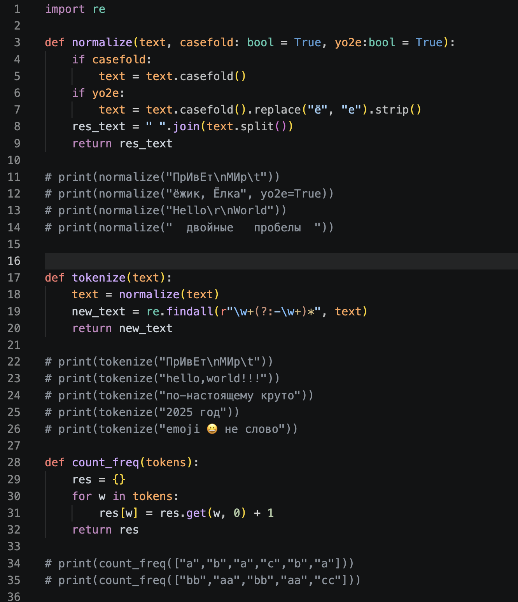
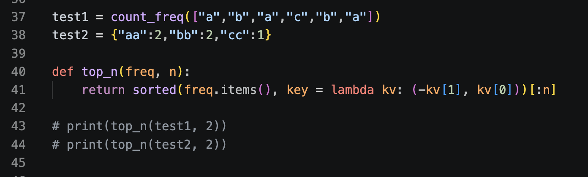

мини тест 1й функции normalize()
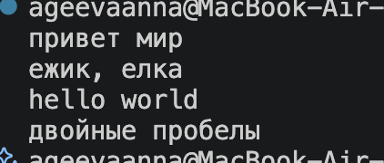

мини тест 1й функции tokenize()
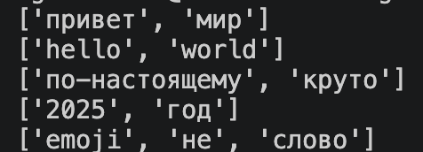

мини тест 1й функции count_freq()
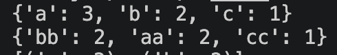

мини тест 1й функции top_n()
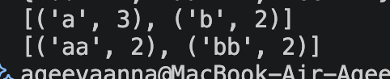

##  Задание 2 
ввела переменные, выполнила функции, требуемые для задания, вывела соответсвующие заданию значения

# Лабораторная работа 2
##  Задание 1 
1. проверила пустой ли список, если да - выводится ошибка, если нет - список сортируется по возрастанию и записываются в мин и макс соотвественное первое и последнее значение нового отсортированного списка.
2. создала список уникальных элементов, прошлась по соседним элементам, сравнивая их друг с другом. В соотвествии с проверкой я их либо меняла местами, чтобы список становился в порядке возрастания, либо оставляла как и есть.
3. создала новый список, куда будут записываться все элементы матрицы. Прошлась по строкам, сделала проверку на то, является ли элемент матрицы списком или кортежем. Если нет - ошибка, да - прохожусь дальше по элементам строки и добавляю каждый в список.

код:
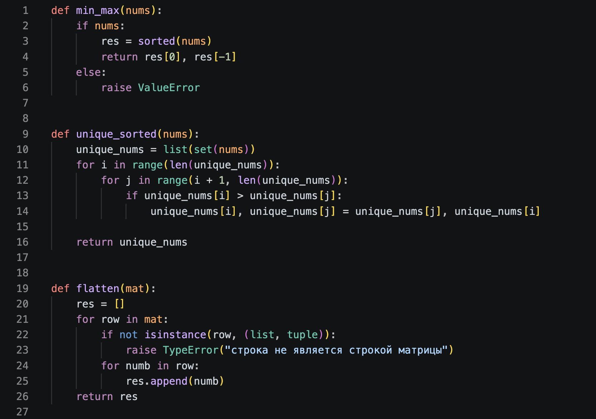

мини тест работы первой функции min_max()
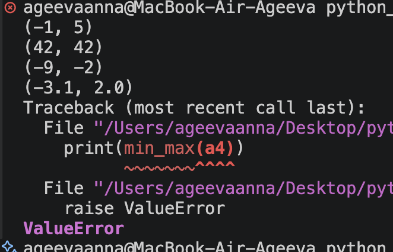

мини тест работы 2 функции unique_sorted
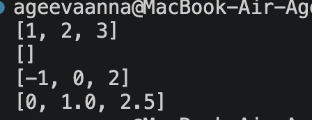

мини тест работы 3 функции flatten
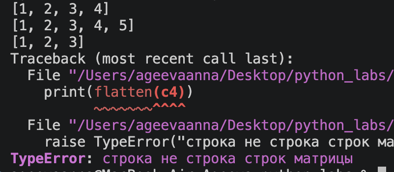

##  Задание 2
в начале каждой функции проверила не пустая ли матрица и прямоугольная или нет. 
1. прохожусь по столбцам, создаю список, который впоследсвии будет новой строкой матрицы. Добавляю в список первый элемент строки каждого столбца. Добавляю строку в новый список для матрицы.
2. прохожусь по каждой строке таблицы, прохожусь по кадому элементу, суммрую значение в переменной sum_row, добавляю итогое значение в список res
3. перебираю колво столбцов, колво строк, в список col_rows суммиру. значения первый элементов каждой строки. добавляю значение в итоговый список res 

код:
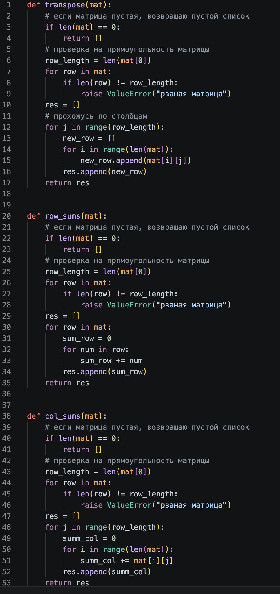

мини тест работы первой функции transpose()
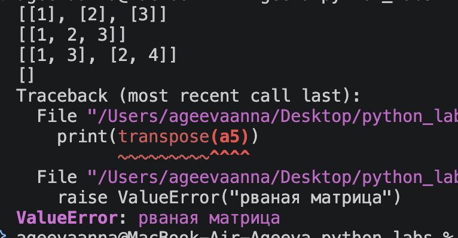

мини тест работы 2 функции row_sums
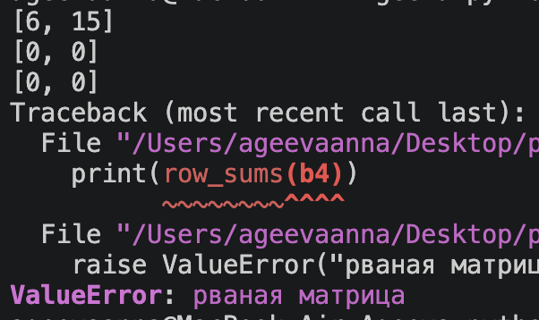

мини тест работы 3 функции col_sums
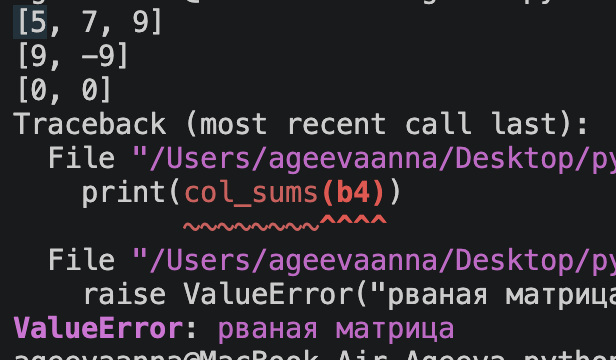

##  Задание 3
проверила каждый элемент кортежа, чтобы он соотвествовал заданию. Если не соотвествовал - прописывала ошибки. Убрала у fio и group лишние пробелы.Проверила, чтобы каждый элемент содержал хоть какие то данные, а значение fio содержало как минимум Фамилию и Имя. Разделила fio с помощью split(). Сделала, чтобы фамилия выводилась с большой буквы, а с отальной информации делались инициалы. Генератором списка прошлась по отсавшимся словам, добавила первую букву в верхнем регистре + точку, соединила инициалы. Вывожу итоговую строку.

код:
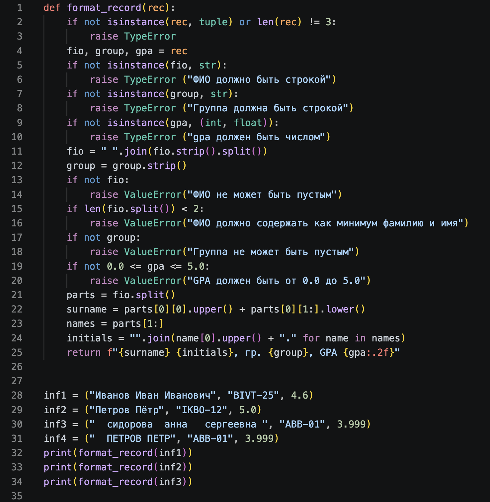

пример вывода кода

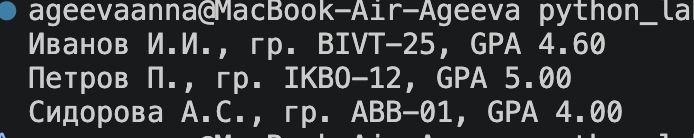

# Лабораторная работа 1 
##  Задание 1 
программа принимает значения имени и возраста, выводит приветствие, учитывая вводные данные

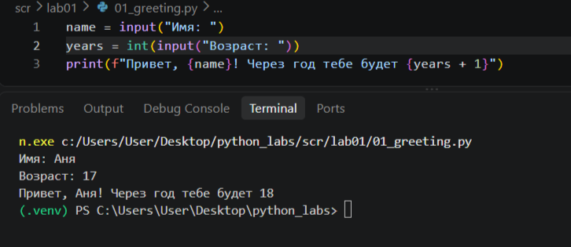

##  Задание 2
программа берет входные значения, при необзодимости (если введено так) меняет "," на ".", произовдит операции и выводит значения, сформатированные так, чтобы после запятой было 2 значения

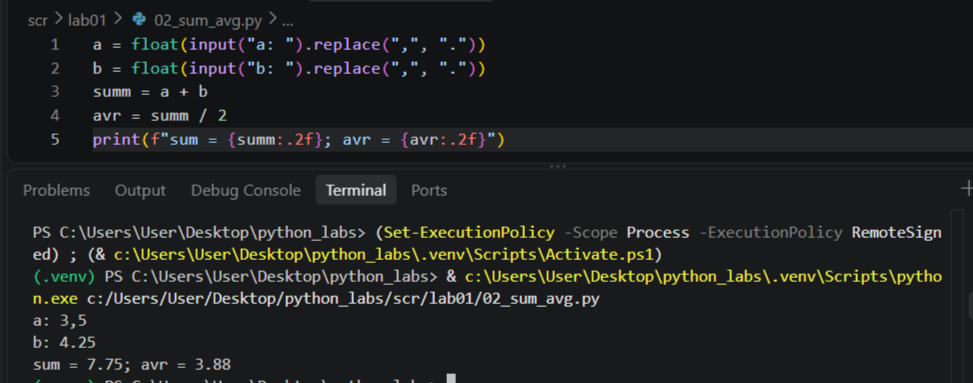

##  Задание 3
принимание входные значения, приводит к floaty, производит над нами операции, вывоит полученные значения, чтобы у них еще было 2 зна после запятой

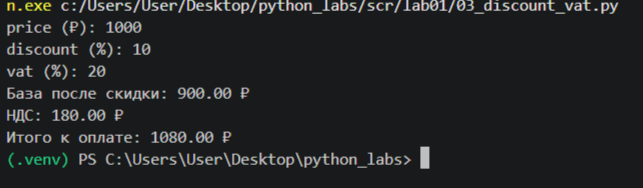

##  Задание 4
ввела минуты, нашла целое колво часов, поделив на 60, колво минут, вывела значения

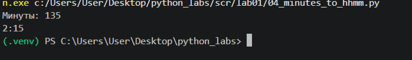

##  Задание 5
ввела значение, разделила по пробелу на отдельные списки, назначила каждому жлементу переменную, (name, sernsme...), забрала из каждого элемент первое значение, сделала чтобы буквы были заглавные. пересобрала ФИО без лишних пробелов, посчитала в отдельной переменной длину, вывела значния

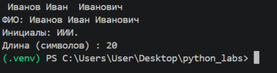

##  Задание 6
завела переменную n, сделала счетчик для подсчета формата обучение, создала цикл, в котором будут проходиться по каждой введенной информации и проверять последнее значение.Если оно == True, то прибавляю 1 к очному формату, иначе - к заочному. Вывожу значения

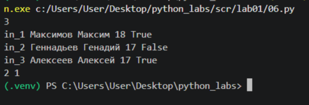

## Задание 7*
нашла две первые буквы используя цикл, записала индексы этиъ символов, чтобы найти расстояние на котором расположены дальнейшие символы слова. Прошлась по срезу строки и собрала слово, учитывая интервал.

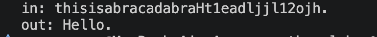
